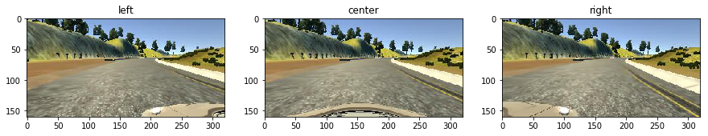
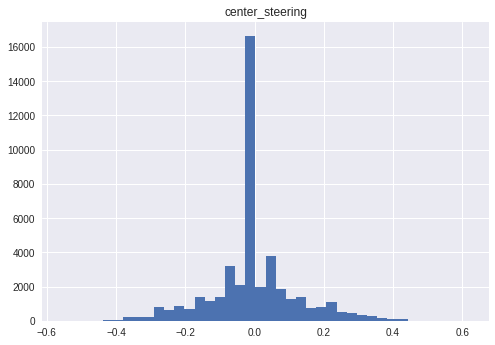
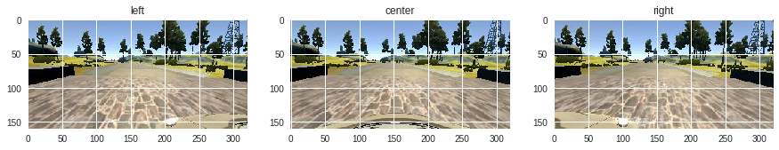
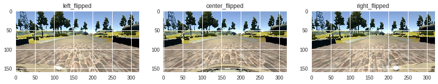
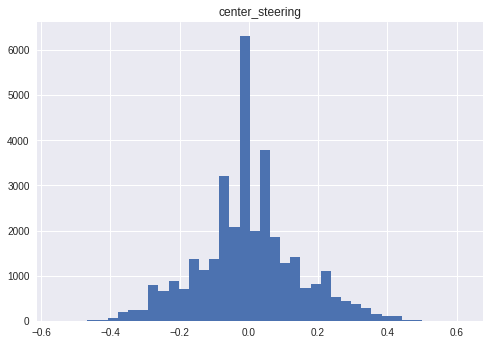
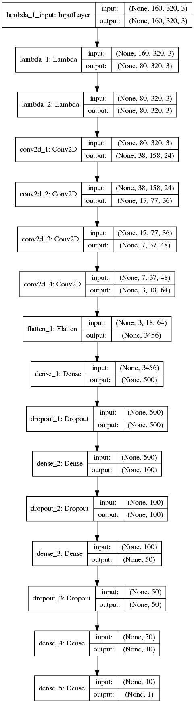

# Submission files
- [x] [model python code]()
- [x] [drive.py]()
- [x] [keras trained model]()
- [x] [writeup(this file)]()

# Data aquisition

Data for training were recorded using the provided simulator. A human driver using a joystick drives the car on track1 in the simulator, which records real-time telemetry data of the steering input, throttle, speed and a stream of three images captured by the three front-facing cameras (left, center, right) attached to the car. At the end, a `csv` log file is generated mapping telemetry data to image files and a folder containing the images.

The car was driven by a human driver on track1 for about 1 hour, and on a mountain track for about 20 min.

The version 1 simulator is used for data collection.

## Raw data visualization

* samples of images:

* steering angle distribution:

## Data augmentation
As we can see, the raw data of the steering has a strong bias to 0.0, i.e. straight driving. To improve the training for turning, we need to augment the raw data. Here I choose the following augmentation techniques, in the sequence of data processing:
* randomly drop 0.0 steering data (with a probability of 0.7) to reduce straight-driving bias.
* use all three camera views:
    * the left and right camera views will have corresponding steering angles that are artificially shifted from the steering angles recorded, which are assigned to the center camera view. The shifting magnitude is `1.5xstandard deviation` of the original steering angles.
* all three cameras images are duplicated as horizontally-mirrored ones and their corresponding steering angles inversed, which results in a two-times-larger dataset.

### here is some visualizations of this augmented dataset

* augmented camera views:

* augmented steering angle distribution:

# Convolutional Neron Network architecture

* The first Lambda layer is fro cropping images to retain only the center portion of the road lanes. The second Lambda layer normalizes the tensor.

* Comparing to NVIDIA's model, my model uses 4 instead of 5 Convolutional layers and a smaller (500 neurons instead of 1164) first fully-connected layer.

* This model has about 1.8M trainable parameters and it can be trained on an old GTX690 for about 10 min.

# Training and tuning
The training dataset was split into 25% validation, 5% testing and 75% training segments.

For an old GTX690 to handle the training, I used Adam optimizer with a bach_size of 144, Epochs of 5 and a learning_rate of 0.001. This model was further tuned using a learning_rate of 0.0005 and Epochs of 3. The validation loss is about 1% for the final model.

Initially, the full NVIDIA's net was used and trained using CPUs because my GTX690 does not have enough memory for bigger models. The result is worse than my model. One possible reason is that the simulation we used in this course does not generate high fidelity images so that we should not use a complex CNN to abstract the image for many levels. Using only the raw dataset with no augmentation does not generate a usable model due to the high bias towards straight-line driving with raw dataset. So, the data augmentation is necessary for this project.

# Test drive

The car can drive at full speed (30MPH) on track 1 with no problem. However, it cannot drive on other tracks for longer than a few tens of seconds. This is due to the fact that the training dataset is so specific and the track used for training is relatively short; we do not have enough data for the car to generalize for other types of terrains. Generalization can be done using transfer learning techniques and fine-tuned using more data, which is left for future improvements.
